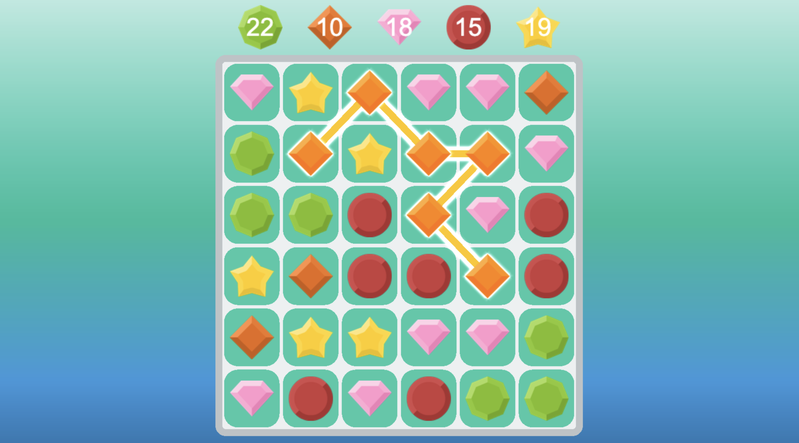

# Match 3 Puzzle Game

Welcome to the Match 3 Puzzle Game! This engaging puzzle game challenges players to match three or more identical elements to score points and clear the board.

## Table of Contents
- [GitHub Pages](#github-pages)
- [Installation](#installation)
- [Development](#development)
- [Screenshots](#screenshots)

## GitHub Pages

The Match 3 Puzzle Game is hosted on GitHub Pages. You can play it by visiting the following link:

[Play Match 3 Puzzle Game](https://bogdanlyopa.github.io/match-3-game/)

## Installation

If you want to run the game locally and make changes, follow these steps:

1. Clone the repository:

```sh
git clone https://github.com/bogdanlyopa/match-3-game.git
```

2. Navigate to the project directory:

```sh
cd match-3-game`
```

3. Ensure you have [Node.js](https://nodejs.org/) installed.

4. Install dependencies:

```sh
npm install`
```

5. Start the development server:

```sh
npm start`
```

6. Open your browser and navigate to `http://localhost:3000`.

That's it! You're ready to start playing the game.

Feel free to explore the `src` directory for the source code and make any enhancements or modifications you deem fit.
That's it! You're ready to start playing the game.

## Development

The Match 3 Puzzle Game was developed using the following technologies and tools:

- **HTML5** 
- **TypeScript:** Providing a strongly typed and more maintainable codebase.
- **Pixi.js:** A powerful 2D rendering engine for creating visually stunning graphics.
- **GSAP (GreenSock Animation Platform):** An animation library for creating smooth and engaging animations.
- **Pixi-filters:** Adding a variety of visual filters to enhance the game's graphics.
- **@pixi/particle-emitter:** Implementing particle effects for a dynamic gaming experience.
- **Webpack:** Bundling and managing project dependencies efficiently.

## Screenshots



## Contact

If you have any questions or suggestions, feel free to reach out:

- Email: bogdanlyopa@gmail.com

- LinkedIn: [Bohdan Lopa](https://www.linkedin.com/in/bohdan-lopa/)
